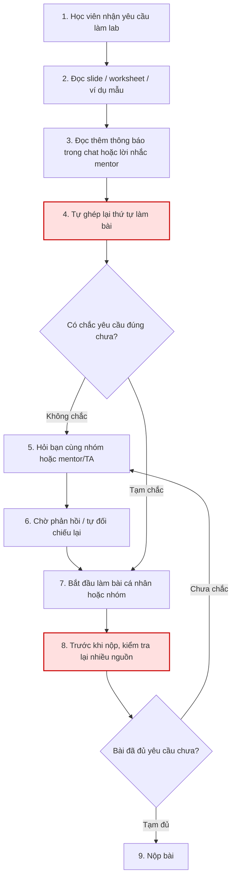
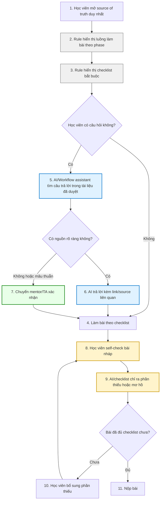

# Phase 3 — Group Convergence

## Mục tiêu

Nhóm đi từ 12 candidate problems của 4 thành viên về 1 candidate problem chung để đào sâu ở các phase sau.

Quy trình hội tụ:

```text
Trình bày top 3
→ gom trùng / cluster
→ shortlist
→ chấm nhanh + đồng thuận chọn 1 candidate problem
```

Ở phase này, nhóm chỉ chọn **candidate problem**, chưa viết Problem Statement hoàn chỉnh.

---

## Bước 3.1 — Trình bày top 3

|  # | Người đưa ra                   | Candidate problem                                                                                                                          | Người gặp vấn đề                           | Điểm nghẽn                                                                            | Cảm nhận nhanh                                                                  |
| -: | ------------------------------ | ------------------------------------------------------------------------------------------------------------------------------------------ | ------------------------------------------ | ------------------------------------------------------------------------------------- | ------------------------------------------------------------------------------- |
|  1 | 2A202600666 - Hoàng Anh Thư    | Lab có nhiều yêu cầu nhưng đề bài, dữ liệu cho sẵn, kết quả và cách nộp còn khó hiểu                                                       | Học viên làm lab, mentor/TA                | Người học khó hiểu đúng yêu cầu, không biết cần làm gì và nộp như thế nào             | Rất sát bài lab, workflow rõ, dễ đo bằng thời gian hiểu đề và số lần hỏi mentor |
|  2 | 2A202600666 - Hoàng Anh Thư    | Sinh viên đọc trước bài nhưng không biết trọng tâm cần học                                                                                 | Sinh viên                                  | Tài liệu trước buổi học chưa được chuyển thành mục tiêu và checklist chuẩn bị rõ ràng | Có pain thật nhưng scope nghiêng về học tập cá nhân hơn bài nhóm                |
|  3 | 2A202600666 - Hoàng Anh Thư    | Học liên tục 10–12h/ngày khiến sinh viên quá tải, chưa kịp hấp thụ                                                                         | Sinh viên                                  | Lượng kiến thức lớn, chưa có cơ chế recap/chia nhỏ để hấp thụ                         | Impact lớn nhưng scope rộng, khó xử lý trong một buổi lab                       |
|  4 | 2A202600662 - Đặng Trần Đạt    | Không có một luồng hướng dẫn chính thức từ đầu đến cuối để làm bài lab                                                                     | Học viên, nhóm làm bài, trợ giảng/mentor   | Thông tin nằm ở nhiều nguồn; người học phải tự ghép thứ tự làm bài                    | Rất rõ workflow, trùng với nhiều candidate khác, phù hợp chọn làm bài nhóm      |
|  5 | 2A202600662 - Đặng Trần Đạt    | Trước khi nộp, người học khó tự kiểm bài đã đủ yêu cầu chưa vì checklist/rubric chưa rõ ràng, dễ dùng                                      | Học viên, nhóm nộp bài                     | Checklist/rubric chưa được chuyển thành danh sách tự kiểm dễ dùng                     | Dễ đo bằng số mục thiếu và thời gian self-check                                 |
|  6 | 2A202600662 - Đặng Trần Đạt    | Feedback/góp ý trong quá trình làm bài bị phân tán ở nhiều nơi, khó tổng hợp thành danh sách cần sửa                                       | Nhóm viết bài, học viên                    | Feedback nằm rải rác ở chat/comment/lời nói/AI, chưa thành action list                | Hợp bài nhóm nhưng scope hẹp hơn candidate chính                                |
|  7 | 2A202600535 - Nguyễn Bách Điệp | Học viên mới dễ bị kẹt ở quy trình GitHub/VS Code: fork repo, clone, sửa markdown, commit/push và kiểm tra đã nộp đúng chưa                | Học viên mới, mentor/TA                    | Quy trình kỹ thuật nhiều bước, dễ lỗi ở fork/clone/commit/push                        | Workflow rất rõ, nhưng scope nghiêng về kỹ thuật GitHub                         |
|  8 | 2A202600535 - Nguyễn Bách Điệp | Học viên đọc slide và worksheet dài nhưng khó biết phần nào là yêu cầu nộp bài thật sự, phần nào chỉ là lý thuyết hoặc hướng dẫn tham khảo | Học viên làm lab                           | Khó phân biệt phần bắt buộc nộp với phần giải thích/tham khảo                         | Trùng mạnh với candidate về source of truth/hướng dẫn phân tán                  |
|  9 | 2A202600535 - Nguyễn Bách Điệp | Khi viết Problem Card, học viên dễ viết vấn đề còn chung chung, thiếu actor, workflow hiện tại, bottleneck, metric và boundary             | Học viên làm bài cá nhân/nhóm              | Chưa có checklist/rubric đủ rõ để tự kiểm chất lượng Problem Card                     | Rất sát trọng tâm Day 02, nhưng là một phần nhỏ trong bài lab                   |
| 10 | 2A202600779 - Cao Việt Hoàng   | Thiếu cơ sở đánh giá năng lực để ghép đội đồng nhất                                                                                        | Học viên, ban tổ chức/quản lý chương trình | Thiếu dữ liệu kỹ năng, ghép nhóm thủ công và cảm tính                                 | Bài toán hay nhưng khác theme chính của nhóm, scope rộng hơn                    |
| 11 | 2A202600779 - Cao Việt Hoàng   | Thông tin và hướng dẫn bị phân tán, thiếu đồng nhất                                                                                        | Người dùng nội bộ, học viên, support/admin | Không có nguồn thông tin tập trung; người dùng không biết tìm ở đâu, hỏi lặp lại      | Trùng rất mạnh với candidate source of truth, phù hợp gom vào cluster chính     |
| 12 | 2A202600779 - Cao Việt Hoàng   | Quá tải kiến thức đối với người học không có nền tảng Tech                                                                                 | Học viên non-tech, giảng viên/coach        | Thuật ngữ kỹ thuật khó, người học mất thời gian tự tìm hiểu và dễ nản                 | Pain thật nhưng scope rộng, nghiêng về học tập dài hạn                          |

---

## Bước 3.2 — Gom trùng / Cluster

| Cluster                                              | Candidates included | Pattern chung                                                                                                                             | Ghi chú                                                                                 |
| ---------------------------------------------------- | ------------------- | ----------------------------------------------------------------------------------------------------------------------------------------- | --------------------------------------------------------------------------------------- |
| A — Hướng dẫn lab / source of truth                  | #1, #4, #8, #11     | Thông tin, hướng dẫn, yêu cầu nộp bài bị phân tán ở nhiều nguồn; học viên không biết đâu là nguồn chính xác và phải tự ghép luồng làm bài | Cụm mạnh nhất vì xuất hiện ở nhiều thành viên, actor rõ, workflow dễ vẽ và impact dễ đo |
| B — Checklist / self-check / chất lượng Problem Card | #5, #9              | Người học khó tự kiểm bài đã đủ yêu cầu chưa; Problem Card dễ thiếu actor, workflow, bottleneck, metric, boundary                         | Có thể là một phần trong solution của Cluster A                                         |
| C — Learning overload / hiểu bài / non-tech          | #2, #3, #12         | Người học quá tải kiến thức, không biết trọng tâm cần học hoặc khó hiểu thuật ngữ kỹ thuật                                                | Pain thật nhưng scope rộng hơn, khó xử lý trọn trong lab hôm nay                        |
| D — Quy trình kỹ thuật / team operation              | #7, #10             | Người học bị kẹt ở GitHub/VS Code hoặc việc ghép nhóm còn thủ công, cảm tính                                                              | Workflow rõ nhưng lệch khỏi theme chung của nhiều thành viên                            |
| E — Feedback khi làm bài                             | #6                  | Feedback/góp ý bị rải rác, khó gom thành action list để sửa bài                                                                           | Hữu ích nhưng chỉ nằm ở giai đoạn sau khi đã có bản nháp                                |

---

## Bước 3.3 — Shortlist

Sau khi gom cluster, nhóm shortlist 3 candidate đáng đào sâu nhất.

| Candidate                                                                                     | Vì sao vào shortlist                                                                                                                                                      | Rủi ro / điều chưa rõ                                                                                         |
| --------------------------------------------------------------------------------------------- | ------------------------------------------------------------------------------------------------------------------------------------------------------------------------- | ------------------------------------------------------------------------------------------------------------- |
| Thông tin và hướng dẫn lab bị phân tán, thiếu một source of truth và luồng làm bài thống nhất | Xuất hiện ở nhiều thành viên; actor rõ; workflow có thể vẽ từ lúc nhận bài đến lúc nộp; impact đo được bằng thời gian hiểu đề, số câu hỏi lặp lại và số mục thiếu khi nộp | Cần xác định nguồn nào sẽ là source of truth chính thức: worksheet, README, slide hay thông báo của mentor/TA |
| Người học khó tự kiểm bài đã đủ yêu cầu chưa trước khi nộp                                    | Rất sát chất lượng bài nộp; dễ đo bằng số field thiếu, thời gian self-check và số lần phải hỏi lại                                                                        | Có thể chỉ là một phần của bài toán source of truth/checklist, không đủ rộng để chọn làm candidate chính      |
| Học viên mới bị kẹt ở quy trình GitHub/VS Code khi nộp bài                                    | Workflow kỹ thuật rõ, dễ đo bằng thời gian push thành công và số lỗi lặp lại                                                                                              | Có thể giải bằng checklist/video hướng dẫn; scope hẹp hơn và không phản ánh pain chung của cả nhóm            |

---

## Bước 3.4 — Score để đồng thuận

Chấm điểm 1–5. Điểm không nhằm tuyệt đối đúng, mà giúp nhóm nói rõ lý do chọn.

| Candidate                                                                                 | Actor rõ | Workflow rõ | Pain có evidence | Impact đo được | Làm trong lab | So sánh R/W/A được | Nhóm hiểu domain | Tổng |
| ----------------------------------------------------------------------------------------- | -------: | ----------: | ---------------: | -------------: | ------------: | -----------------: | ---------------: | ---: |
| Thông tin và hướng dẫn lab bị phân tán, thiếu source of truth và luồng làm bài thống nhất |        5 |           5 |                5 |              5 |             5 |                  5 |                5 |   35 |
| Người học khó tự kiểm bài đã đủ yêu cầu chưa trước khi nộp                                |        5 |           4 |                4 |              5 |             5 |                  4 |                5 |   32 |
| Học viên mới bị kẹt ở quy trình GitHub/VS Code khi nộp bài                                |        5 |           5 |                4 |              5 |             4 |                  4 |                4 |   31 |

---

## Candidate nhóm chọn

```text
Thông tin và hướng dẫn lab bị phân tán, thiếu một source of truth và luồng làm bài thống nhất.
```

---

## Vì sao chọn

Nhóm chọn candidate này vì đây là vấn đề xuất hiện lặp lại ở nhiều thành viên, đặc biệt trong các candidate của Hoàng Anh Thư, Đặng Trần Đạt, Nguyễn Bách Điệp và Cao Việt Hoàng. Các candidate tuy diễn đạt khác nhau nhưng đều chỉ về cùng một pattern: học viên phải đọc nhiều nguồn như slide, worksheet, ví dụ mẫu, nhóm chat, README hoặc lời nhắc của mentor/TA để hiểu mình cần làm gì và nộp như thế nào.

Problem này có actor rõ: học viên làm lab, nhóm làm bài, mentor/TA hoặc support/admin. Workflow hiện tại cũng có thể vẽ được: nhận bài → đọc nhiều nguồn → tự ghép yêu cầu → hỏi lại → làm bài → kiểm tra trước khi nộp. Bottleneck nằm ở bước người học phải tự tổng hợp và xác nhận thông tin đúng từ nhiều nguồn phân tán.

Candidate này có impact đo được bằng các metric như thời gian hiểu đề, số lần hỏi lại mentor/TA, số câu hỏi lặp lại, số mục bị thiếu khi nộp và số lỗi do đọc nhầm tài liệu hoặc dùng thông tin cũ. Ngoài ra, bài toán này đủ phù hợp để so sánh No AI / Rule / Workflow / Agent ở các phase sau.

---

## Vì sao không chọn các candidate còn lại

Nhóm không chọn candidate “người học khó tự kiểm bài đã đủ yêu cầu chưa” vì đây là vấn đề rõ và dễ đo, nhưng phạm vi hẹp hơn. Nó có thể được xem là một bước trong solution của candidate chính: sau khi có source of truth, nhóm có thể xây checklist/self-check để giúp học viên kiểm bài trước khi nộp.

Nhóm không chọn candidate “học viên mới bị kẹt ở quy trình GitHub/VS Code” vì workflow rất rõ nhưng scope nghiêng về kỹ thuật nộp bài. Vấn đề này có thể giải bằng checklist hoặc video hướng dẫn riêng. Trong khi đó, candidate chính bao quát hơn vì xử lý toàn bộ luồng hiểu yêu cầu, làm bài và nộp bài.

Nhóm không chọn candidate “quá tải kiến thức với người học non-tech” vì đây là pain thật nhưng phạm vi rộng, liên quan đến thiết kế chương trình học, nhịp học và nền tảng kiến thức. Bài toán này khó giải quyết trọn trong một buổi lab.

Nhóm không chọn candidate “thiếu cơ sở đánh giá năng lực để ghép đội” vì đây là bài toán hay nhưng lệch khỏi pattern chung của nhóm. Nó liên quan nhiều hơn đến team matching và quản lý chương trình, trong khi đa số candidate của nhóm tập trung vào việc hướng dẫn, làm lab và nộp bài.

Nhóm không chọn candidate “feedback/góp ý bị phân tán” vì đây là pain thật khi làm bài nhóm nhưng xảy ra ở giai đoạn sau khi đã có bản nháp. Nó có thể được xem như một nhánh phụ trong workflow sau, thay vì là candidate chính.

---

## Nếu có disagreement, nhóm xử lý thế nào

Nếu có bất đồng, nhóm không vote ngay theo cảm tính mà dùng bảng score để so sánh. Nhóm ưu tiên candidate có các tiêu chí: actor rõ, workflow hiện tại vẽ được, bottleneck cụ thể, impact đo được, làm được trong phạm vi lab hôm nay và có thể so sánh Rule / Workflow / Agent.

Sau khi chấm nhanh, candidate “thông tin và hướng dẫn lab bị phân tán, thiếu source of truth và luồng làm bài thống nhất” có tổng điểm cao nhất. Nhóm thống nhất chọn candidate này để đưa sang Phase 4 vì nó bao quát được nhiều candidate nhỏ hơn, nhưng vẫn đủ cụ thể để validate, research và vẽ workflow trước/sau.

---

## Tóm tắt quyết định Phase 3

```text
Nhóm chọn candidate problem:
Thông tin và hướng dẫn lab bị phân tán, thiếu một source of truth và luồng làm bài thống nhất.

Lý do ngắn gọn:
Problem này xuất hiện ở nhiều thành viên, có actor rõ, workflow rõ, bottleneck cụ thể, impact đo được và phù hợp để so sánh No AI / Rule / Workflow / Agent trong các phase tiếp theo.
```

---

# Phase 4 — Quick Validation + Research giải pháp

## Candidate problem nhóm đang kiểm chứng

```text
Thông tin và hướng dẫn lab bị phân tán, thiếu một source of truth và luồng làm bài thống nhất.
```

## Mục tiêu Phase 4

Sau khi chọn candidate problem, nhóm cần kiểm tra nhanh:

* Pain có thật không?
* Người khác có gặp không?
* Đã có giải pháp nào tương tự chưa?
* Bài toán này có nên giải bằng AI không?

---

## Bước 4.1 — Quick Validation

### Cách nhóm kiểm chứng nhanh

Nhóm chọn kết hợp 2 cách:

1. **Quick interview** với một số học viên trong lớp.
2. **Mini poll / hỏi nhanh trong nhóm** để kiểm tra mức độ phổ biến của pain.

### Câu hỏi quick interview

```text
1. Lần gần nhất bạn bị rối khi đọc hướng dẫn làm lab là khi nào?
2. Bạn phải đọc những nguồn nào để hiểu cần làm gì?
3. Bước nào làm bạn mất thời gian nhất?
4. Bạn mất khoảng bao lâu để hiểu đúng yêu cầu?
5. Bạn có từng hỏi lại mentor/TA hoặc bạn cùng nhóm không?
6. Nếu có một source of truth/checklist rõ ràng, bạn muốn nó giúp gì?
```

### Câu hỏi micro survey / poll

```text
1. Bạn có gặp tình trạng hướng dẫn lab bị phân tán ở nhiều nguồn không?
2. Tần suất gặp: hiếm / thỉnh thoảng / thường xuyên?
3. Bước nào đau nhất?
   - Tìm đúng yêu cầu nộp bài
   - Phân biệt phần lý thuyết và phần cần nộp
   - Tự kiểm bài đã đủ chưa
   - Hỏi lại mentor/TA
4. Hiện bạn workaround bằng cách nào?
5. Mức độ đáng giải quyết: 1–5?
```

---

## Kết quả quick validation

> Lưu ý: Nếu nhóm chưa hỏi thật, cần thay số liệu bên dưới bằng kết quả thực tế sau khi phỏng vấn/poll.

| Nguồn                            |       Số người / số mẫu | Tín hiệu xác nhận                                                                                                                                                                        | Tín hiệu phản bác                                                                          | Nhóm sửa problem thế nào                                                                                                                |
| -------------------------------- | ----------------------: | ---------------------------------------------------------------------------------------------------------------------------------------------------------------------------------------- | ------------------------------------------------------------------------------------------ | --------------------------------------------------------------------------------------------------------------------------------------- |
| Quick interview                  |              3 học viên | 2/3 người nói từng phải đọc nhiều nguồn như slide, worksheet, ví dụ mẫu và tin nhắn nhóm để hiểu cần làm gì. Cả 2 đều mất khoảng 15–30 phút để xác định thứ tự làm bài hoặc yêu cầu nộp. | 1 người nói nếu đọc kỹ worksheet từ đầu thì vẫn có thể hiểu được, không nhất thiết cần AI. | Nhóm sửa lại problem: không nói “thiếu hướng dẫn”, mà nói “hướng dẫn có nhưng phân tán, thiếu source of truth và checklist theo luồng”. |
| Mini poll / hỏi nhanh trong nhóm |              6 phản hồi | 4/6 người từng hỏi lại về format, workflow trước/sau, Problem Card hoặc repo structure. Nhiều người muốn có checklist theo từng phase.                                                   | Một số câu hỏi có thể xử lý bằng README hoặc pinned post, chưa cần AI.                     | Thêm non-AI alternative: README duy nhất, checklist nộp bài, template repo/folder.                                                      |
| Log / review / ticket            | Ghi chú từ câu hỏi nhóm | Có nhiều câu hỏi lặp lại như “làm cá nhân trước hay nhóm trước?”, “có cần workflow cho cả 3 problem không?”, “nộp folder nào?”, “bài đã đủ chưa?”.                                       | Chưa có log chính thức đủ lớn để định lượng chính xác số lần hỏi lại.                      | Nhóm xem đây là evidence định tính ban đầu, chưa dùng làm số liệu cứng.                                                                 |

---

## Insight sau validation

```text
Pain thật không nằm ở việc “không có tài liệu”, mà nằm ở việc người học phải tự ghép nhiều nguồn tài liệu thành một luồng làm bài rõ ràng.

Vì vậy, bài toán nên được thu hẹp thành:
Làm sao giúp học viên xác định đúng nguồn chính thức, hiểu thứ tự làm bài và tự kiểm bài trước khi nộp mà không phải hỏi lại nhiều lần?
```

---

## Bước 4.2 — Research giải pháp đã có

Nhóm tìm các tool/pattern đã giải quyết bài toán tương tự về knowledge base, source of truth, AI search và checklist/self-check.

| Nguồn / tool / case                | Link                                                                                                                            | Họ giải quyết phần nào?                                                                                           | Điểm mạnh                                                                                                 | Khoảng trống / rủi ro                                                                                                          | Bài học cho nhóm                                                                                                 |
| ---------------------------------- | ------------------------------------------------------------------------------------------------------------------------------- | ----------------------------------------------------------------------------------------------------------------- | --------------------------------------------------------------------------------------------------------- | ------------------------------------------------------------------------------------------------------------------------------ | ---------------------------------------------------------------------------------------------------------------- |
| Notion Enterprise Search           | [Notion Enterprise Search](https://www.notion.com/help/enterprise-search)                                                       | Tìm câu trả lời từ workspace và các app kết nối như Slack, Google Drive, Jira.                                    | Có thể hỏi bằng ngôn ngữ tự nhiên và trả lời kèm nguồn để người dùng quay lại tài liệu gốc.               | Phụ thuộc vào chất lượng tài liệu đầu vào. Nếu tài liệu cũ, mâu thuẫn hoặc thiếu cập nhật thì AI vẫn có thể trả lời chưa đúng. | Bài của nhóm nên yêu cầu AI trả lời kèm nguồn và không trả lời chắc chắn nếu không có tài liệu gốc.              |
| Slack AI Search                    | [Slack AI Search](https://slack.com/help/articles/31739993134867-Search-with-AI-in-Slack)                                       | Giúp người dùng hỏi bằng ngôn ngữ tự nhiên và nhận câu trả lời dựa trên message/file trong workspace.             | Phù hợp khi nhiều thông tin nằm trong chat, thread hoặc file chia sẻ. Có citation về source message/file. | Nếu thông tin quan trọng nằm ngoài Slack hoặc chưa được tổ chức tốt, AI Search chỉ giải quyết được một phần.                   | Có thể dùng pattern “trả lời từ nguồn có sẵn + dẫn nguồn”, nhưng không nên xem chat là source of truth duy nhất. |
| Atlassian Confluence / Rovo Search | [Confluence Rovo Search](https://support.atlassian.com/confluence-cloud/docs/use-atlassian-intelligence-to-search-for-answers/) | Cho phép hỏi trực tiếp trong Confluence và nhận câu trả lời dựa trên thông tin có sẵn trong workspace.            | Phù hợp với bài toán knowledge base nội bộ, tài liệu hướng dẫn, quy trình và FAQ.                         | Nếu tài liệu chưa được chuẩn hóa thành page/space rõ ràng, câu trả lời vẫn có thể thiếu hoặc không kích hoạt.                  | Trước khi dùng AI, cần có một knowledge base/source of truth được tổ chức tốt.                                   |
| README + checklist nộp bài         | Pattern thủ công                                                                                                                | Gom toàn bộ yêu cầu nộp bài, folder structure, thứ tự phase và checklist vào một file duy nhất.                   | Đơn giản, ít rủi ro, dễ làm ngay trong lab.                                                               | Không tự trả lời được câu hỏi diễn đạt khác nhau; người học vẫn phải tự đọc và tự đối chiếu.                                   | Đây nên là lớp Rule/process fix đầu tiên trước khi thêm AI.                                                      |
| FAQ / pinned post                  | Pattern thủ công                                                                                                                | Trả lời các câu hỏi lặp lại như “nộp folder nào?”, “có cần workflow không?”, “làm cá nhân trước hay nhóm trước?”. | Giảm tải cho mentor/TA với câu hỏi lặp lại.                                                               | Dễ bị trôi, dễ cũ nếu có cập nhật mới; không xử lý tốt câu hỏi phức tạp.                                                       | Có thể kết hợp FAQ với workflow AI để trả lời câu hỏi phổ biến dựa trên nguồn đã duyệt.                          |

---

## Research takeaway

```text
Các tool như Notion Enterprise Search, Slack AI Search và Confluence/Rovo đều cho thấy một pattern chung: AI hữu ích nhất khi được đặt trên một knowledge base/source of truth rõ ràng và trả lời có dẫn nguồn.

Vì vậy, nhóm không nên bắt đầu bằng một Agent tự quyết định toàn bộ quy trình làm bài. Hướng hợp lý hơn là:

1. Chuẩn hóa source of truth trước.
2. Tạo checklist theo từng phase.
3. Dùng AI/Workflow assistant để trả lời câu hỏi dựa trên tài liệu chính thức.
4. Luôn có human boundary: câu hỏi mâu thuẫn, thiếu nguồn hoặc thay đổi yêu cầu phải chuyển mentor/TA.
```

---

## Bài học kéo về bài toán nhóm

| Bài học                                | Ý nghĩa với bài toán nhóm                                                                                                                |
| -------------------------------------- | ---------------------------------------------------------------------------------------------------------------------------------------- |
| Source of truth quan trọng hơn chatbot | Nếu tài liệu chưa thống nhất, AI chỉ làm vấn đề lan rộng hơn vì có thể trả lời dựa trên nguồn cũ hoặc mâu thuẫn.                         |
| AI cần trả lời kèm nguồn               | Với bài lab, câu trả lời nên dẫn về worksheet, README, slide hoặc thông báo chính thức để học viên tự kiểm lại.                          |
| Rule/process fix vẫn cần trước         | README, checklist và template repo có thể giải quyết nhiều case đơn giản mà không cần AI.                                                |
| Workflow phù hợp hơn Agent             | Bài toán có luồng khá rõ: hỏi → tìm nguồn → trả lời → self-check → escalate mentor nếu không chắc. Chưa cần AI tự lập kế hoạch phức tạp. |
| Human boundary bắt buộc                | AI không được tự đổi deadline, tự chấm điểm, tự tạo yêu cầu mới hoặc trả lời chắc chắn khi nguồn mâu thuẫn.                              |

---

## Kết luận Phase 4

```text
Pain có thật: Có dấu hiệu rõ qua việc học viên phải đọc nhiều nguồn, hỏi lại format/thứ tự làm bài và khó tự kiểm trước khi nộp.

Có người khác gặp không: Có, nhưng nhóm cần tiếp tục validate thêm bằng survey/log thật nếu muốn metric chắc hơn.

Đã có giải pháp tương tự chưa: Có. Các pattern như README/checklist, FAQ, knowledge base search, Notion Enterprise Search, Slack AI Search và Confluence/Rovo đều xử lý một phần bài toán.

Bài toán có nên giải bằng AI không: Có thể, nhưng không nên bắt đầu bằng Agent. Hướng phù hợp là Workflow: source of truth + checklist + AI trả lời theo tài liệu + self-check + chuyển mentor/TA nếu không chắc.
```

---

# Phase 5 — Workflow + Problem Statement

## Candidate problem nhóm đang đào sâu

```text
Thông tin và hướng dẫn lab bị phân tán, thiếu một source of truth và luồng làm bài thống nhất.
```

---

# Bước 5.1 — Current Workflow bản nhóm

## Current workflow — trạng thái hiện tại



## Dán workflow hoặc link file

```text
02-group-problem-statement-current-workflow.md
```

## Bảng current workflow chi tiết

| Bước | Actor                        | Input                                                 | Output                               | Thời gian/tần suất       | Ghi chú                                                          |
| ---: | ---------------------------- | ----------------------------------------------------- | ------------------------------------ | ------------------------ | ---------------------------------------------------------------- |
|    1 | Học viên                     | Yêu cầu làm lab từ buổi học                           | Nhận biết có bài cần làm             | 1–2 phút / mỗi phase lab | Điểm bắt đầu của workflow                                        |
|    2 | Học viên                     | Slide, worksheet, ví dụ mẫu                           | Hiểu sơ bộ bài cần làm               | 10–15 phút               | Có nhiều nguồn nên người học phải tự đọc và đối chiếu            |
|    3 | Học viên                     | Tin nhắn nhóm, lời nhắc mentor/TA, thông báo cập nhật | Thêm thông tin bổ sung hoặc thay đổi | 5–10 phút                | Thông tin mới có thể nằm ngoài worksheet ban đầu                 |
|    4 | Học viên                     | Tất cả nguồn đã đọc                                   | Tự ghép lại thứ tự làm bài           | 10–20 phút               | **Bottleneck chính:** người học phải tự tạo luồng làm bài        |
|    5 | Học viên / nhóm              | Phần chưa chắc về yêu cầu                             | Câu hỏi gửi bạn/mentor/TA            | 2–5 phút / mỗi lần hỏi   | Câu hỏi thường lặp lại về format, thứ tự làm bài, workflow, repo |
|    6 | Mentor/TA hoặc bạn cùng nhóm | Câu hỏi của học viên                                  | Câu trả lời hoặc hướng dẫn thêm      | 5–20 phút tùy thời điểm  | Phụ thuộc vào người hỗ trợ; nếu bận có thể chờ lâu               |
|    7 | Học viên / nhóm              | Cách hiểu sau khi hỏi lại                             | Bắt đầu làm bài cá nhân hoặc nhóm    | Liên tục trong lab       | Nếu hiểu sai từ đầu, các bước sau dễ bị lệch                     |
|    8 | Học viên / nhóm              | Bài nháp + worksheet/rubric + checklist rời rạc       | Tự kiểm bài trước khi nộp            | 10–20 phút               | Dễ thiếu field vì checklist không được gom thành một nơi         |
|    9 | Học viên / nhóm              | Bài đã hoàn thiện                                     | Repo/file nộp bài                    | 2–5 phút                 | Vẫn có rủi ro thiếu phần bắt buộc                                |

## Bottleneck chính

```text
Bottleneck chính nằm ở bước học viên phải tự ghép và xác nhận thông tin đúng từ nhiều nguồn phân tán.

Vấn đề không phải là “không có tài liệu”, mà là tài liệu, ví dụ, thông báo và checklist chưa được gom thành một source of truth có luồng làm bài rõ ràng. Vì vậy, học viên mất thời gian để tự hiểu thứ tự làm bài, dễ hỏi lại cùng một nội dung và có nguy cơ nộp thiếu phần bắt buộc.
```

---

# Bước 5.2 — Future Workflow bản nhóm

## Future workflow — trạng thái sau tối ưu



## Dán workflow hoặc link file

```text
02-group-problem-statement-future-workflow.md
```

## Bảng future workflow chi tiết

| Bước | Actor                   | Input                                             | Output                             | Thời gian/tần suất   | Ghi chú                                                  |
| ---: | ----------------------- | ------------------------------------------------- | ---------------------------------- | -------------------- | -------------------------------------------------------- |
|    1 | Học viên                | Link source of truth                              | Mở đúng nơi chứa toàn bộ hướng dẫn | Dưới 1 phút          | Source of truth có thể là README/Notion/Google Doc       |
|    2 | Rule / Template         | Cấu trúc lab                                      | Luồng làm bài theo phase           | Dưới 1 phút          | Rule xử lý phần cố định: cá nhân → nhóm → reflection     |
|    3 | Rule / Checklist        | Rubric, yêu cầu nộp bài                           | Checklist bắt buộc                 | Dưới 1 phút          | Checklist giúp học viên biết cần đủ những mục nào        |
|    4 | Học viên                | Checklist theo phase                              | Làm bài theo đúng thứ tự           | Liên tục trong lab   | Người học vẫn là người thực hiện chính                   |
|    5 | AI / Workflow assistant | Câu hỏi của học viên + tài liệu đã duyệt          | Câu trả lời nháp                   | 1–2 phút             | AI chỉ trả lời dựa trên nguồn đã duyệt                   |
|    6 | AI / Workflow assistant | Tài liệu chính thức                               | Câu trả lời kèm nguồn              | 1–2 phút             | Cần gắn link/source để người học kiểm lại                |
|    7 | Mentor/TA               | Câu hỏi không chắc, nguồn mâu thuẫn hoặc ngoại lệ | Xác nhận chính thức                | 5–10 phút tùy mức độ | **Human boundary:** câu hỏi rủi ro cao chuyển người thật |
|    8 | Học viên                | Bài nháp                                          | Bản tự kiểm                        | 5 phút               | Học viên chạy checklist trước khi nộp                    |
|    9 | AI / Checklist          | Bài nháp + checklist                              | Danh sách phần thiếu/mơ hồ         | 2–5 phút             | AI hỗ trợ self-check, không chấm điểm                    |
|   10 | Học viên                | Feedback checklist                                | Bài được bổ sung                   | 5–15 phút            | Người học tự sửa, không để AI viết thay reflection       |
|   11 | Học viên / nhóm         | Bài đã đủ checklist                               | Repo/file nộp bài                  | 2–5 phút             | Nộp sau khi đã review lần cuối                           |

## Rule xử lý phần nào?

```text
Rule xử lý các phần có cấu trúc cố định:
- Thứ tự làm bài: cá nhân → nhóm → reflection
- Folder/repo structure
- Checklist các mục bắt buộc
- FAQ cơ bản như: nộp folder nào, có cần workflow không, cần top 3 hay top 1
```

## AI/Workflow hỗ trợ phần nào?

```text
AI/Workflow assistant hỗ trợ các phần cần hiểu ngôn ngữ tự nhiên:
- Trả lời câu hỏi của học viên dựa trên tài liệu chính thức
- Tóm tắt yêu cầu theo phase
- Chỉ ra phần bài nháp còn thiếu hoặc mơ hồ
- Gợi ý học viên quay lại đúng mục trong source of truth
```

## Con người vẫn làm phần nào?

```text
Học viên vẫn tự chọn problem, tự viết Problem Card, tự pitch, tự quyết định nội dung reflection và tự chịu trách nhiệm với bài nộp.

Mentor/TA vẫn xác nhận các câu hỏi ngoại lệ, thay đổi yêu cầu, mâu thuẫn tài liệu hoặc vấn đề liên quan đến đánh giá điểm.
```

## Human boundary

```text
AI không tự thay đổi yêu cầu bài nộp.
AI không tự sửa deadline.
AI không tự tạo yêu cầu mới.
AI không tự chấm điểm.
AI không viết reflection thay học viên.
AI không trả lời chắc chắn nếu nguồn tài liệu mâu thuẫn hoặc không có nguồn rõ ràng.

Các câu hỏi không chắc phải chuyển mentor/TA.
```

## Fallback nếu AI sai

```text
Nếu AI trả lời sai, không tìm thấy nguồn hoặc phát hiện tài liệu mâu thuẫn, hệ thống sẽ:
1. Không đưa câu trả lời chắc chắn.
2. Gắn trạng thái “cần mentor/TA xác nhận”.
3. Chuyển câu hỏi cho mentor/TA.
4. Cho học viên quay lại source of truth chính thức để tự kiểm.
```

## Before / After Impact

| Metric                          |                                        Trước |                                          Sau kỳ vọng | Ghi chú                                                          |
| ------------------------------- | -------------------------------------------: | ---------------------------------------------------: | ---------------------------------------------------------------- |
| Số bước                         |                                       9 bước |                                              11 bước | Số bước có thể tăng nhẹ, nhưng rõ hơn và ít vòng lặp hỏi lại hơn |
| Tổng thời gian xác định yêu cầu |                                   25–60 phút |                                            5–15 phút | Giảm thời gian tự ghép thông tin từ nhiều nguồn                  |
| Số bước thủ công                |                                     8/9 bước |                                            5/11 bước | Rule/AI hỗ trợ checklist, hỏi đáp và self-check                  |
| Bottleneck chính                |             Tự ghép thông tin từ nhiều nguồn | Review câu hỏi không chắc / mentor xác nhận ngoại lệ | Bottleneck chuyển sang điểm kiểm soát chất lượng                 |
| Risk mới                        | Không có AI sai, nhưng dễ hiểu lệch tài liệu |         AI có thể trả lời sai hoặc dựa trên nguồn cũ | Cần source of truth, citation và human boundary                  |

---

# Bước 5.3 — Problem Statement v0

| Field              | Nội dung                                                                                                                                                                                                                                     |
| ------------------ | -------------------------------------------------------------------------------------------------------------------------------------------------------------------------------------------------------------------------------------------- |
| **Actor**          | Học viên làm lab, nhóm học viên làm bài nhóm, mentor/TA hỗ trợ giải đáp yêu cầu và kiểm tra bài.                                                                                                                                             |
| **Workflow**       | Học viên nhận bài lab → đọc slide, worksheet, ví dụ mẫu, chat nhóm và lời nhắc mentor → tự ghép thứ tự làm bài → hỏi lại nếu không chắc → làm bài → tự kiểm thủ công trước khi nộp.                                                          |
| **Bottleneck**     | Học viên phải tự tổng hợp và xác nhận thông tin đúng từ nhiều nguồn phân tán. Chưa có một source of truth và checklist theo luồng để biết cần làm gì trước/sau và bài nộp phải đủ những phần nào.                                            |
| **Impact**         | Học viên mất 25–60 phút để hiểu yêu cầu và tự kiểm; mentor/TA phải trả lời nhiều câu hỏi lặp lại; nhóm dễ hiểu khác nhau; bài nộp có nguy cơ thiếu field như Problem Card, workflow, metric, boundary hoặc decision.                         |
| **Success Metric** | Giảm thời gian xác định yêu cầu từ 25–60 phút xuống 5–15 phút; giảm 50–70% câu hỏi lặp lại về format/thứ tự làm bài; ít nhất 80% học viên tự xác định đúng luồng làm bài; giảm số bài thiếu field bắt buộc.                                  |
| **Boundary**       | AI chỉ trả lời dựa trên tài liệu đã duyệt và phải gắn nguồn. AI không tự đổi deadline, không tạo yêu cầu mới, không chấm điểm, không viết reflection thay học viên. Câu hỏi không chắc, nguồn mâu thuẫn hoặc ngoại lệ phải chuyển mentor/TA. |

---

## Prompt phản biện Problem Statement v0

```text
Đây là Problem Statement v0 của nhóm tôi:

Actor:
Học viên làm lab, nhóm học viên làm bài nhóm, mentor/TA hỗ trợ giải đáp yêu cầu và kiểm tra bài.

Workflow:
Học viên nhận bài lab → đọc slide, worksheet, ví dụ mẫu, chat nhóm và lời nhắc mentor → tự ghép thứ tự làm bài → hỏi lại nếu không chắc → làm bài → tự kiểm thủ công trước khi nộp.

Bottleneck:
Học viên phải tự tổng hợp và xác nhận thông tin đúng từ nhiều nguồn phân tán. Chưa có một source of truth và checklist theo luồng để biết cần làm gì trước/sau và bài nộp phải đủ những phần nào.

Impact:
Học viên mất 25–60 phút để hiểu yêu cầu và tự kiểm; mentor/TA phải trả lời nhiều câu hỏi lặp lại; nhóm dễ hiểu khác nhau; bài nộp có nguy cơ thiếu field như Problem Card, workflow, metric, boundary hoặc decision.

Success Metric:
Giảm thời gian xác định yêu cầu từ 25–60 phút xuống 5–15 phút; giảm 50–70% câu hỏi lặp lại về format/thứ tự làm bài; ít nhất 80% học viên tự xác định đúng luồng làm bài; giảm số bài thiếu field bắt buộc.

Boundary:
AI chỉ trả lời dựa trên tài liệu đã duyệt và phải gắn nguồn. AI không tự đổi deadline, không tạo yêu cầu mới, không chấm điểm, không viết reflection thay học viên. Câu hỏi không chắc, nguồn mâu thuẫn hoặc ngoại lệ phải chuyển mentor/TA.

Hãy chỉ ra field nào còn mơ hồ, metric đã đo được chưa, boundary đã rõ chưa.
Đừng viết lại thay tôi. Chỉ đặt câu hỏi và chỉ ra lỗ hổng.
```

---

# Break (10')

---

# Phase 6 — Rule / Workflow / Agent + Decision

## Candidate problem nhóm đang xử lý

```text
Thông tin và hướng dẫn lab bị phân tán, thiếu một source of truth và luồng làm bài thống nhất.
```

---

# Bước 6.0 — Ma trận độ phù hợp với AI

## Bài toán của nhóm nằm ở ô nào?

```text
Độ mơ hồ trung bình đến cao + độ phức tạp trung bình.
Phù hợp nhất với Workflow có AI hỗ trợ một số bước, chưa cần Agent.
```

## Vì sao?

```text
Bài toán có nhiều nguồn thông tin: slide, worksheet, ví dụ mẫu, README, nhóm chat và lời nhắc của mentor/TA. Người học cần biết nguồn nào là đúng, thứ tự làm bài là gì và bài nộp cần đủ những phần nào.

Một phần bài toán có độ mơ hồ thấp, ví dụ: folder cần nộp, số lượng Problem Cards, có cần workflow trước/sau không. Các phần này có thể xử lý bằng Rule/checklist.

Tuy nhiên, một số câu hỏi của học viên có thể được diễn đạt bằng nhiều cách khác nhau, hoặc cần đối chiếu với nhiều tài liệu. Phần này cần AI hỗ trợ tìm thông tin, tóm tắt theo ngữ cảnh và trả lời kèm nguồn.

Chưa cần Agent vì AI không cần tự lập kế hoạch phức tạp, không cần tự quyết định thay mentor/TA, không cần tự thay đổi yêu cầu hoặc deadline. Workflow là đủ: source of truth → checklist → AI trả lời theo tài liệu → self-check → chuyển mentor/TA nếu không chắc.
```

---

# Bước 6.1 — So sánh Rule / Workflow / Agent

| Mức          | Phương án cho bài toán nhóm                                                                                                   | Khi nào đủ                                                                                                              | Rủi ro                                                                                                                                                                | Chọn?                                                 |
| ------------ | ----------------------------------------------------------------------------------------------------------------------------- | ----------------------------------------------------------------------------------------------------------------------- | --------------------------------------------------------------------------------------------------------------------------------------------------------------------- | ----------------------------------------------------- |
| **Rule**     | Tạo README/source of truth duy nhất, checklist theo phase, FAQ cố định, template repo/folder.                                 | Đủ với các câu hỏi cố định như: nộp folder nào, cần bao nhiêu Problem Cards, thứ tự phase là gì, checklist gồm mục nào. | Không xử lý tốt câu hỏi diễn đạt khác nhau; không đọc được bài nháp để chỉ ra phần còn thiếu; nếu tài liệu thay đổi mà checklist không cập nhật thì vẫn gây hiểu sai. | Dùng một phần, nhưng không chọn làm toàn bộ solution. |
| **Workflow** | Source of truth + checklist + AI trả lời theo tài liệu chính thức + AI/self-check bài nháp + chuyển mentor/TA nếu không chắc. | Phù hợp khi workflow có nhiều bước rõ ràng, nhưng một số bước cần hiểu ngôn ngữ tự nhiên và đối chiếu nhiều nguồn.      | AI có thể trả lời sai nếu nguồn mâu thuẫn hoặc tài liệu cũ; cần citation/source và human boundary rõ.                                                                 | **Chọn.**                                             |
| **Agent**    | AI tự tìm nhiều nguồn, tự quyết định câu trả lời, tự cập nhật checklist, tự điều phối câu hỏi đến mentor/TA.                  | Chỉ phù hợp nếu hệ thống lớn, nhiều công cụ, nhiều loại yêu cầu và AI cần tự quyết định bước tiếp theo.                 | Quá rộng cho lab hôm nay; rủi ro AI tự tạo yêu cầu mới, hiểu sai deadline, trả lời vượt quyền hoặc làm học viên phụ thuộc.                                            | Không chọn.                                           |

## Mức chọn

```text
Workflow.
```

## Vì sao chọn?

```text
Nhóm chọn Workflow vì bài toán có luồng xử lý khá rõ: học viên mở source of truth → xem checklist theo phase → đặt câu hỏi nếu không chắc → AI trả lời dựa trên tài liệu đã duyệt → học viên self-check bài nháp → câu hỏi không chắc chuyển mentor/TA.

Rule/checklist cần có nhưng chưa đủ, vì học viên có thể hỏi bằng nhiều cách khác nhau và cần đối chiếu nhiều nguồn. Agent thì quá sớm vì AI không cần tự lập kế hoạch hoặc tự quyết định thay con người. Workflow là mức cân bằng nhất giữa hiệu quả, kiểm soát rủi ro và khả năng triển khai trong lab.
```

## Vì sao không chọn mức đơn giản hơn?

```text
Không chọn Rule làm toàn bộ solution vì Rule chỉ xử lý tốt các trường hợp cố định. Ví dụ, checklist có thể nói “cần top 3 Problem Cards”, nhưng nếu học viên hỏi “phần này có cần workflow cho cả 3 problem không?” hoặc “bài của em thiếu gì trước khi nộp?”, Rule khó xử lý linh hoạt.

Workflow có AI hỗ trợ sẽ tốt hơn vì AI có thể đọc câu hỏi tự nhiên, đối chiếu với tài liệu đã duyệt, trả lời kèm nguồn và hỗ trợ self-check bài nháp. Tuy nhiên, AI vẫn bị giới hạn bởi boundary và không được tự quyết định thay mentor/TA.
```

## Vì sao không chọn Agent?

```text
Không chọn Agent vì bài toán chưa cần AI tự lập kế hoạch, tự gọi nhiều công cụ hay tự thay đổi bước tiếp theo. Nếu dùng Agent quá sớm, rủi ro sẽ cao hơn lợi ích: AI có thể tự diễn giải sai yêu cầu, tự tạo checklist không đúng, hoặc trả lời vượt phạm vi.

Nhóm chỉ cần một workflow có kiểm soát, trong đó AI hỗ trợ các bước cụ thể và con người vẫn giữ quyền xác nhận cuối cùng.
```

---

# Bước 6.2 — Problem Statement v1

| Field                            | Nội dung                                                                                                                                                                                                                                     |
| -------------------------------- | -------------------------------------------------------------------------------------------------------------------------------------------------------------------------------------------------------------------------------------------- |
| **Actor**                        | Học viên làm lab, nhóm học viên làm bài nhóm, mentor/TA hỗ trợ giải đáp yêu cầu và kiểm tra bài.                                                                                                                                             |
| **Workflow**                     | Học viên nhận bài lab → đọc slide, worksheet, ví dụ mẫu, README, nhóm chat và lời nhắc mentor/TA → tự ghép thứ tự làm bài → hỏi lại nếu không chắc → làm bài → tự kiểm thủ công trước khi nộp.                                               |
| **Bottleneck**                   | Học viên phải tự tổng hợp và xác nhận thông tin đúng từ nhiều nguồn phân tán. Chưa có một source of truth và checklist theo luồng để biết cần làm gì trước/sau, phần nào là bắt buộc và bài nộp phải đủ những mục nào.                       |
| **Impact**                       | Học viên mất khoảng 25–60 phút để hiểu yêu cầu và tự kiểm; mentor/TA phải trả lời nhiều câu hỏi lặp lại; nhóm dễ hiểu khác nhau; bài nộp có nguy cơ thiếu field như Problem Card, workflow, metric, boundary hoặc decision.                  |
| **Success Metric**               | Giảm thời gian xác định yêu cầu từ 25–60 phút xuống 5–15 phút; giảm 50–70% câu hỏi lặp lại về format/thứ tự làm bài; ít nhất 80% học viên tự xác định đúng luồng làm bài; giảm số bài thiếu field bắt buộc.                                  |
| **Boundary**                     | AI chỉ trả lời dựa trên tài liệu đã duyệt và phải gắn nguồn. AI không tự đổi deadline, không tạo yêu cầu mới, không chấm điểm, không viết reflection thay học viên. Câu hỏi không chắc, nguồn mâu thuẫn hoặc ngoại lệ phải chuyển mentor/TA. |
| **AI intervention point**        | Sau khi học viên có câu hỏi hoặc cần tự kiểm bài nháp, trước khi phải hỏi mentor/TA. AI hỗ trợ tìm câu trả lời từ source of truth, gợi ý checklist liên quan và đánh dấu phần bài còn thiếu/mơ hồ.                                           |
| **Mức chọn**                     | Workflow: Rule/checklist xử lý phần cố định; AI hỗ trợ hỏi đáp và self-check; mentor/TA xử lý ngoại lệ và xác nhận cuối.                                                                                                                     |
| **Rủi ro & người thật kiểm tra** | Rủi ro chính là AI trả lời sai do tài liệu cũ, thiếu nguồn hoặc nguồn mâu thuẫn. Người kiểm tra là mentor/TA và học viên: AI phải gắn nguồn, học viên tự kiểm lại, câu hỏi không chắc phải escalate cho mentor/TA.                           |

---

# Bước 6.3 — Final Decision

| Câu hỏi                                      | Yes / Not Yet / No   | Ghi chú                                                                                                                        |
| -------------------------------------------- | -------------------- | ------------------------------------------------------------------------------------------------------------------------------ |
| Actor và workflow đã rõ chưa?                | Yes                  | Actor gồm học viên, nhóm học viên, mentor/TA. Workflow từ nhận bài đến nộp bài đã vẽ được.                                     |
| Baseline và success metric đã đo được chưa?  | Not Yet              | Đã có ước lượng 25–60 phút và mục tiêu 5–15 phút, nhưng cần survey/interview thật để chắc hơn.                                 |
| Có data/input đủ dùng chưa?                  | Not Yet              | Có worksheet, slide, ví dụ mẫu, README, chat/log câu hỏi; nhưng cần gom lại và xác định nguồn chính thức trước.                |
| Nếu AI sai, hậu quả có chấp nhận được không? | Yes, nếu có boundary | Có thể chấp nhận trong pilot nhỏ nếu AI chỉ trả lời kèm nguồn và câu không chắc phải chuyển mentor/TA.                         |
| Có người review/owner vận hành không?        | Yes                  | Mentor/TA hoặc một thành viên nhóm có thể làm owner cập nhật source of truth và checklist.                                     |
| Có cách non-AI đơn giản hơn không?           | Yes                  | README, checklist, FAQ và template repo có thể giải quyết một phần lớn. Vì vậy AI chỉ nên hỗ trợ thêm, không thay thế toàn bộ. |

## Decision

```text
Go với scope nhỏ.
```

## Lý do

```text
Nhóm chọn Go với scope nhỏ vì problem rõ, actor rõ, workflow vẽ được và impact có thể đo. Tuy nhiên, nhóm không triển khai Agent toàn phần. Hướng đi hợp lý là bắt đầu bằng source of truth + checklist + FAQ, sau đó dùng AI trong workflow để hỗ trợ hỏi đáp theo tài liệu và self-check bài nháp.

Quyết định này giữ được cân bằng: tận dụng AI ở bước có giá trị, nhưng vẫn kiểm soát rủi ro bằng human boundary và fallback cho mentor/TA.
```

## Nếu Go, pilot nhỏ nhất là

```text
1. Gom các nguồn chính thức của một lab: worksheet, slide, README, ví dụ mẫu, checklist nộp bài.
2. Tạo một source of truth duy nhất cho lab đó.
3. Tạo checklist theo phase: cá nhân → nhóm → reflection → nộp bài.
4. Thu thập 20–30 câu hỏi thường gặp của học viên.
5. Cho workflow assistant/AI trả lời thử các câu hỏi dựa trên source of truth.
6. Yêu cầu AI luôn gắn nguồn hoặc mục checklist liên quan.
7. Mentor/TA review câu trả lời theo 3 mức: đúng / cần sửa / sai nghiêm trọng.
8. Thử self-check 3–5 bài nháp xem AI/checklist có phát hiện được phần thiếu không.
9. So sánh thời gian tìm yêu cầu, số câu hỏi lặp lại và số mục bị thiếu trước/sau pilot.
```

## Nếu Not Yet, cần validate gì trước?

```text
Cần validate thêm 3 điểm trước khi triển khai rộng:

1. Baseline thật:
   - Học viên mất bao lâu để hiểu yêu cầu?
   - Phải đọc bao nhiêu nguồn?
   - Câu hỏi nào bị lặp lại nhiều nhất?

2. Chất lượng source of truth:
   - Nguồn nào là chính thức?
   - Có nội dung nào mâu thuẫn giữa worksheet, slide, README hoặc lời nhắc mentor không?
   - Ai chịu trách nhiệm cập nhật?

3. Độ an toàn của AI:
   - AI có trả lời đúng khi hỏi về format/deadline/checklist không?
   - AI có biết từ chối khi không có nguồn không?
   - Mentor/TA có dễ review log câu trả lời không?
```

## Nếu No-Go, nên làm gì thay AI?

```text
Nếu không dùng AI, nhóm vẫn nên triển khai process fix:

1. Tạo README duy nhất làm source of truth.
2. Tạo checklist nộp bài dạng checkbox.
3. Tạo FAQ cho câu hỏi lặp lại.
4. Ghim source of truth trong nhóm chat.
5. Cử một owner cập nhật khi có thay đổi.
6. Tạo template repo/folder để học viên điền theo.

Phương án No-AI này ít rủi ro hơn, nhưng sẽ không linh hoạt bằng workflow có AI khi học viên hỏi bằng nhiều cách khác nhau hoặc cần self-check bài nháp.
```

---

# Tóm tắt quyết định Phase 6

```text
Mức chọn: Workflow.

Lý do:
Rule/checklist cần có nhưng chưa đủ. Agent thì quá sớm và nhiều rủi ro. Workflow phù hợp nhất vì bài toán có luồng rõ, AI chỉ hỗ trợ các bước cụ thể như hỏi đáp theo tài liệu và self-check bài nháp, còn mentor/TA vẫn xử lý ngoại lệ và xác nhận cuối.

Decision:
Go với scope nhỏ.
```

---

# Phase 7 — Individual Reflection


- [ ] [12đ cá nhân] Cá nhân có 5+ problems và top 3 Problem Cards.
- [ ] [12đ cá nhân] Tôi đã pitch rõ và challenge nhóm đúng trọng tâm.
- [ ] Nhóm có nhật ký hội tụ từ candidates về 1 bài.
- [ ] [15đ nhóm] Nhóm có workflow trước/sau.
- [ ] [20đ nhóm] Nhóm có Problem Statement v0/v1 với metric và boundary rõ.
- [ ] [15đ nhóm] Nhóm có so sánh No AI / Rule / Workflow / Agent.
- [ ] [10đ nhóm] Nhóm có Go / Not Yet / No-Go và lý do rõ.
- [ ] [10đ cá nhân] Reflection cá nhân có nói rõ vai trò trong nhóm, cách dùng AI, điều học được và nếu làm lại sẽ đổi gì.
- [ ] [6đ cá nhân] Tôi tự giải thích được mạch problem → workflow → metric → boundary → độ phù hợp với AI.

---

_Day 02 Lab — Worksheet_
